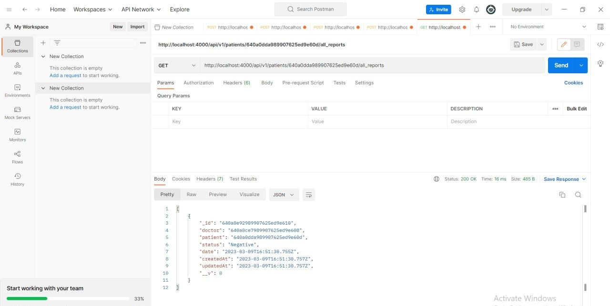

## My Hospital Api
## https://github.com/Harshvardhanshinde14 created by Harshvardhan Shinde.

## Theme
    I designed Hospital api for the doctors of Hospitals which have been alloted for testing purposes of COVID+

    . There can be two types of users 
    . Doctors
    . Patient
    . Doctors would register
    . Doctors would login
    . each time patients visit doctor would do two steps
    . Register the patient in the app 
    . After the checkup, create a Report
    . Patient Report will have the following fields
    . Created by doctor
    . Status
    . Can be either of: [Negative,
     Travelled-Quarantine, Symptoms-Quarantine, Positive-Admit] from the qn documentation

## Prerequisites
    1 Node.js
    2 Git

## Tech Used
    1 mongoose.js
    2 jwt
    3 passport
    4 passport-local

### install the npm first
`npm install`
### start the server
`npm start`

### This is my doctors register

### This is my doctor login

### This is my patients register

### This is my patients create_report

### This is my patients all_reports

### Note:: I have checked the given api and upload and attached it to my images folder as well 

## Folder Structure

| --- .vscode 
| ---   config 
| ---    | -- middleware  
| ---    | -- mongoose  
| ---    | -- passport_jwt_strategy 
| ---    controllers 
| ---    | -- api 
| ---    | -- | -- v1 
| ---    | -- | -- | -- doctor_controller 
| ---    | -- | -- | -- patient_controller 
| ---    | -- | -- | -- report_controller 
| ---    images 
| ---     models 
| ---     | -- doctor 
| ---     | -- patient 
| ---     | -- report 
| ---     routes 
| ---     | --api 
| ---     | --| -- v1 
| ---     | --| --  | --- doctors 
| ---     | --| --  | --- index 
| ---     | --| --  | --- patients 
| ---     | --| --  | --- reports 
| ---     | --| -- index 
| ---     | -- index  
| ---     .gitignore 
| ---      index 
| ---      package-lock.json 
| ---      package.json 
| ---      Readme.md 

  
